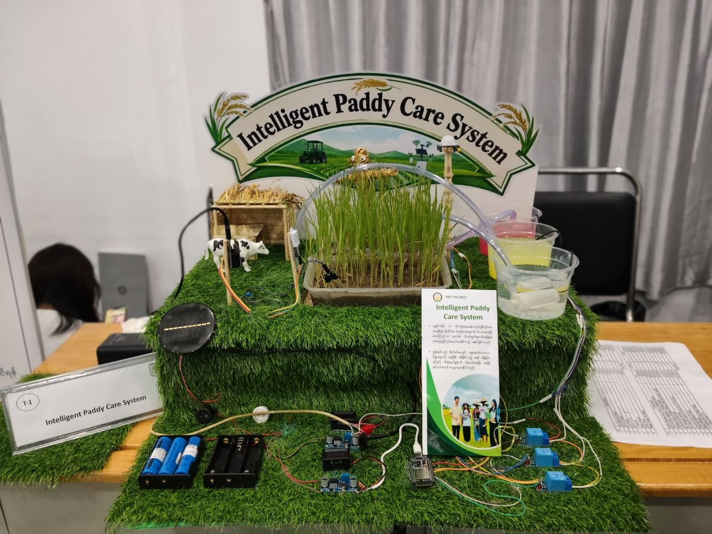
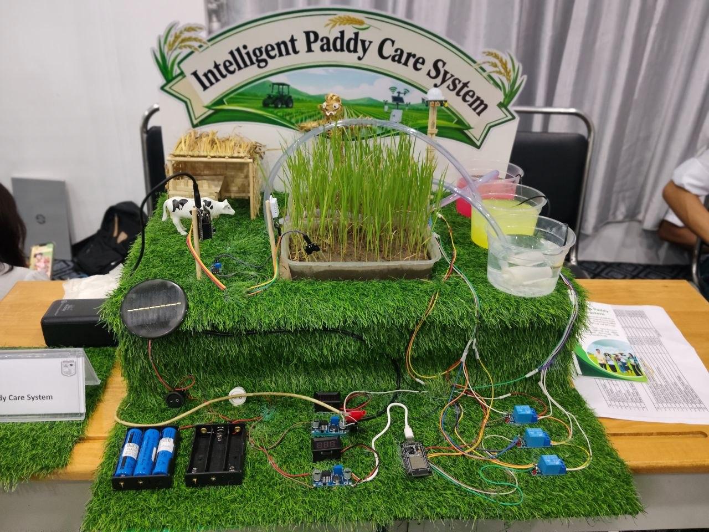

# Plant Monitoring — Rice Paddy Monitor

A Flutter app that turns an **ESP32 + ESP32-CAM** field station into a rice-paddy monitoring
assistant. It reads live sensor values from the board, grades them against agronomy thresholds,
streams the camera, and can send a captured photo plus the current readings to an AI model for a
rice-specific diagnosis (disease, treatment, care plan).

The UI is fully Cupertino (iOS-style) and bilingual: **English / မြန်မာ**.

---

## Features

| Tab | What it does |
| --- | --- |
| **Home** | Live sensor cards (temperature, humidity, soil moisture), an overall plant verdict, pull-to-refresh, and two one-tap AI actions: *Diagnose the plant* and *What should I spray?* — each grabs a fresh photo from the ESP32-CAM and asks the model about it. |
| **Live** | Full-bleed MJPEG camera stream with frosted-glass overlays showing status and sensor summary. |
| **AI Scan** | Pick a photo from the gallery or take one with the phone camera, send it with live sensor context, and get a detailed rice health analysis. |
| **Settings** | Change the ESP32 host/port, test the connection, and switch the app language. |

Home also carries an **elevated "Open Blynk" button** — it launches the installed Blynk app
(`cloud.blynk`) for pump/fan/light control, falling back to the Play Store when it isn't installed.
[`BlynkService.writePin`](lib/services/blynk_service.dart) can also drive a virtual pin directly
through the Blynk Cloud HTTP API.

Other behaviour worth knowing:

- **Threshold-first, AI-second.** Temperature / humidity / soil status is computed locally
  (no network, no quota). The AI is used only for photo-based questions and the optional care guide.
- **Language-locked answers.** The model is instructed to answer in the selected language, and the
  reply is validated ([`isReadableAnswer`](lib/services/gemini_service.dart)) — a garbled or
  wrong-language answer is replaced with a warning instead of being shown.
- **Not-a-plant guard.** If the photo isn't a plant, the model returns a sentinel token and the app
  shows a friendly notice rather than a hallucinated diagnosis.
- **Single-client camera handling.** The ESP32-CAM accepts only one stream client, so previews are
  paused (`streamPaused`) while a still is being captured, and only the visible tab streams.
- **Capture fallbacks.** `/capture` is tried on the stream port, then on port 80; if neither exists,
  a JPEG frame is carved out of the MJPEG stream (SOI `FFD8` → EOI `FFD9`).

---

## Hardware / device contract

The field station — *Intelligent Paddy Care System* — as built and exhibited: an ESP32 driving the
sensors, relay bank, buzzer and pump, powered from an 18650 pack with a solar panel and buck
converters, watering a live rice tray.

| | |
| --- | --- |
|  |  |

The app talks to the board over plain HTTP:

| Endpoint | Default | Purpose |
| --- | --- | --- |
| `http://<host>/data` | port 80 | Sensor readings |
| `http://<host>:<streamPort>/stream` | port 8080 | MJPEG live stream |
| `http://<host>:<streamPort>/capture` | port 8080 | Still JPEG (falls back to `http://<host>/capture`, then to a stream frame) |

`/data` may return **either JSON or an HTML dashboard** — both are parsed
([`_parseSensorData`](lib/services/plant_service.dart)). JSON keys recognised:

```json
{ "temperature": 28.4, "humidity": 72.0, "soil_moisture": 1 }
```

`soilMoisture` is accepted as an alias for `soil_moisture`. Soil moisture is a **digital 0/1**
sensor (0 = dry, 1 = wet) and is mapped to a percentage for display.

Default host is `172.24.78.154` — change it in **Settings** (in-memory only; see *Limitations*).

---

## Thresholds

All defined as constants in [lib/services/plant_service.dart](lib/services/plant_service.dart):

**Temperature (°C)** — `<15` cold stress · `15–20` low · `20–32` optimal · `32–35` warm · `>35` heat stress
**Humidity (%)** — `<50` dry · `50–80` normal · `>80` high
**Soil** — `0` dry · `1` wet
**Nutrients / light** — N ≥ 50, P ≥ 30, K ≥ 50, light ≥ 5000 lx

The overall verdict (`good` / `dry` / `pestRisk` / `tooHot` / `tooCold`) drives the status colour
and icon on Home. High humidity combined with temperature above 28 °C is flagged as **pest risk**.

---

## AI backend

Despite the class name `GeminiService` (kept so call sites didn't change), requests go to
**OpenRouter's OpenAI-compatible `/chat/completions` API**. Two models are used:

- a text model for the sensor-only care guide (default `openai/gpt-oss-120b`)
- a **vision** model for anything with an image (default `google/gemma-4-26b-a4b-it:free`)

> Do **not** set the vision model to `openrouter/free` — that auto-routes into a pool that includes
> content-safety classifiers and models that mangle Burmese text.

The system prompt pins the model to a rice agronomy role: growth stages (seedling → ripening) and
rice diseases (blast, bacterial leaf blight, sheath blight, brown spot, tungro, false smut).

---

## Setup

### 1. Requirements

- Flutter with Dart SDK `^3.11.5`
- An OpenRouter API key
- The ESP32 station reachable on the same network as the phone

### 2. Environment

Create a `.env` file in the project root (it is bundled as a Flutter asset):

```env
OPENROUTER_API_KEY=sk-or-...
OPENROUTER_BASE_URL=https://openrouter.ai/api/v1
OPENROUTER_MODEL=openai/gpt-oss-120b
OPENROUTER_VISION_MODEL=google/gemma-4-26b-a4b-it:free
```

Only `OPENROUTER_API_KEY` is required; the rest fall back to the defaults above. Without a key the
app still runs — sensors, thresholds and the live stream work — but AI actions report a missing-key
error.

### 3. Run

```bash
flutter clean
flutter pub get
flutter run
```

### 4. Regenerate icons / splash (only after changing the art)

```bash
dart run flutter_launcher_icons
dart run flutter_native_splash:create
```

Source art lives in `assets/icon/` and `assets/splash/`; `tool/make_app_icon.ps1` regenerates the
icon PNGs. Brand colours: `#1A7A4A` (light) / `#0F4A2C` (dark).

---

## Project structure

```
lib/
  main.dart                    App entry — dotenv load, splash hold, CupertinoApp
  l10n/app_strings.dart        AppLanguage enum, LocaleController, EN + MM string tables
  models/ai_care_advice.dart   Structured care-guide JSON (headline, summary, actions, urgency)
  screens/
    root_shell.dart            4-tab IndexedStack + ActiveTab scope (stream arbitration)
    home_screen.dart           Sensor cards, verdict, AI ask-about-photo actions
    camera_screen.dart         Full-bleed MJPEG stream with glass overlays
    ai_scan_screen.dart        Gallery / phone-camera photo analysis
    settings_screen.dart       Host, port, connection test, language picker
  services/
    plant_service.dart         Singleton ChangeNotifier store: fetch, parse, thresholds, capture
    gemini_service.dart        OpenRouter client, prompts, language + not-a-plant validation
  theme/app_colors.dart        iOS system palette
  widgets/
    glass_nav_bar.dart         Floating frosted-glass bottom nav with expanding pill
    rich_answer.dart           Minimal markdown renderer (**bold** + bullets), no extra package
```

**State management** is deliberately minimal: [`PlantService.instance`](lib/services/plant_service.dart)
is a singleton `ChangeNotifier` that every tab observes via `ListenableBuilder`; language is an
`InheritedNotifier` (`AppLocale`) so a language change rebuilds the whole tree.

---

## Localization

Strings live in a single file, [lib/l10n/app_strings.dart](lib/l10n/app_strings.dart), as an
abstract `AppStrings` interface with `_EnStrings` and `_MyStrings` implementations — no ARB/codegen.
To add a string: add the getter to `AppStrings`, then implement it in **both** classes.

---

## Documentation

Non-code user documentation is in [docs/](docs/):

- `Rice_Paddy_Monitoring_User_Guide.docx`
- `Rice_Paddy_Monitoring_Quick_Reference.xlsx`

---

## Limitations / notes

- **Settings are not persisted.** Host, port and language reset to defaults on app restart.
- **Firebase is wired but disabled.** `firebase_core`, `firebase_options.dart`, Firestore rules and
  a Data Connect schema are present, but initialization is commented out in
  [main.dart](lib/main.dart).
- **Automatic AI care guide is off.** `refreshAiAdvice()` exists and works, but isn't called from
  `refresh()` — it was disabled to save API quota. Re-enable by calling it there.
- **NPK and light** have thresholds and getters but are not yet supplied by `/data`.
- **HTTP, not HTTPS.** The board is reached over cleartext HTTP on the local network; platform
  cleartext-traffic permissions must allow this.
- The codebase's inline comments are written in Burmese.
